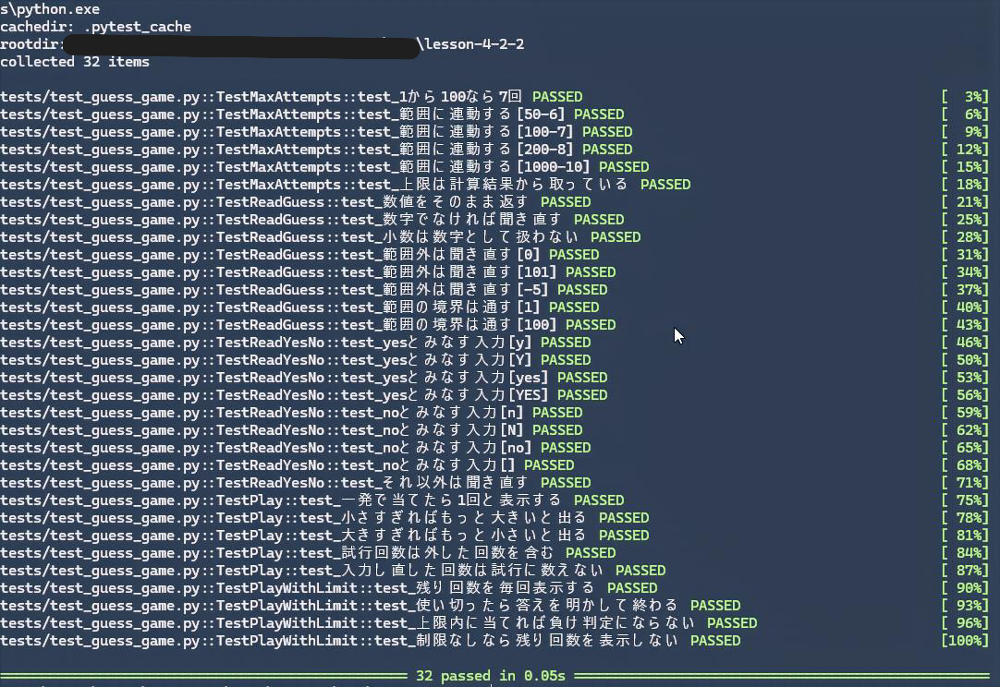
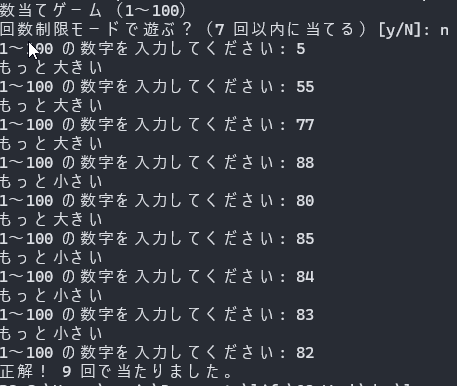
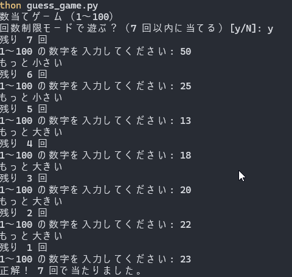

# 4-2-2 課題1: 数当てゲーム

AIエンジニア講座 Section 4-2「Python 実践」の実装課題。

## 課題の要件

- コンピューターが 1〜100 の数字をランダムに選び、ユーザーがそれを当てる
- 入力に応じて「もっと大きい」「もっと小さい」というヒントを表示する
- 正解時に試行回数を知らせる

## ファイル

| ファイル | 役割 |
|---|---|
| `guess_game.py` | 課題の成果物。数当てゲーム本体 |
| `verify_binary_search.py` | 追加機能の「7回制限」に根拠があるかを確かめた検証スクリプト |
| `tests/test_guess_game.py` | pytest のテスト（32 件） |

## 実行方法

```powershell
python guess_game.py
```

Python の標準ライブラリだけで動くため、追加のインストールは不要。

## テスト

```powershell
python -m venv .venv
.venv\Scripts\python.exe -m pip install pytest
.venv\Scripts\python.exe -m pytest tests -q
```



`input()` と `print()` をモックしているので、対話しなくても実行できる。乱数も固定している。

**テストが本当に効いているかは、わざと壊して確かめた。** `MAX_ATTEMPTS` を定数 `7` に戻して
範囲を 1〜200 に広げると `test_上限は計算結果から取っている` が落ちる。
最初に書いたテストはこの変更を検出できておらず、`math.ceil(math.log2(...))` を
テスト側で計算し直しているだけで実装を一行も呼んでいなかった。

## 実装した機能

### 課題の要件

1. 1〜100 の乱数を `random.randint` で選ぶ
2. 予想が小さければ「もっと大きい」、大きければ「もっと小さい」を表示する
3. 正解したら試行回数を表示する

### 追加した機能

4. **入力チェック** — 数字以外（`abc` `3.5`）と範囲外（`0` `101`）は聞き直す
5. **回数制限モード** — 起動時に選ぶと 7 回以内に当てるルールになる。残り回数を毎回表示し、
   使い切ったら答えを公開して終わる。上限は範囲から計算するため、`MAX_NUMBER` を変えても連動する
6. **中断の扱い** — Ctrl+C / Ctrl+Z で終了したときにトレースバックを出さず、
   「中断しました。」と表示して終わる

## 実行例

### 通常モード



大小のヒントを頼りに範囲を狭めていく。正解すると試行回数が出る。

### 回数制限モード



残り回数を毎回表示する。この記録は答えが 23 で、**7 回ぴったりで正解している**。

まん中を選び続ける戦略なら 6 手で当たる場面だった。

| | 手順 | 手数 |
|---|---|---|
| この記録 | 50 → 25 → **13** → 18 → 20 → 22 → 23 | 7 |
| まん中戦略 | 50 → 25 → **12** → 18 → 21 → 23 | 6 |

3 手目で 12 ではなく 13 を選んだ差が最後まで残っている。
7 回という上限は、**まん中から 1 つずれる程度しか余裕がない**。

### 入力チェック

```
1〜100 の数字を入力してください: abc
数字で入力してください。
1〜100 の数字を入力してください: 3.5
数字で入力してください。
1〜100 の数字を入力してください: 101
1 から 100 の範囲で入力してください。
```

## 「7回」にした根拠

大小のヒントが返るので、まん中を選び続ければ候補は毎回半分になる。
100 通りを 1 通りまで絞るのに必要な回数は `log2(100) ≈ 6.64` で、切り上げると 7。

コードでは `7` を直接書かず、範囲から計算している。

```python
MAX_ATTEMPTS = math.ceil(math.log2(MAX_NUMBER - MIN_NUMBER + 1))
```

定数で持つと `MAX_NUMBER` を変えたときに破綻するため。範囲を 1〜200 にした時点で
8 手必要になり、7 手制限では絶対に勝てないゲームになってしまう。

| 範囲 | 必要な手数 |
|---|---|
| 1〜50 | 6 |
| 1〜100 | 7 |
| 1〜200 | 8 |
| 1〜1000 | 10 |

ただし式だけでは足りるか実感できなかったため、1〜100 のすべての答えについて手数を数えた。

```powershell
python verify_binary_search.py
```

```
最小 1 手 / 最大 7 手 / 平均 5.80 手
手数の分布:
  1 手:   1 通り  #
  2 手:   2 通り  ##
  3 手:   4 通り  ####
  4 手:   8 通り  ########
  5 手:  16 通り  ################
  6 手:  32 通り  ################################
  7 手:  37 通り  #####################################
```

手数が 1・2・4・8・16・32 と倍々に増えている。6 手までで当たるのは合計 63 通り（2⁶ − 1）で、
**残りの 37 通りがちょうど 7 手**。つまり 7 回制限は余裕のある上限ではなく、ぎりぎり足りるライン。
6 回に減らすと 37 通りは絶対に当てられない。
