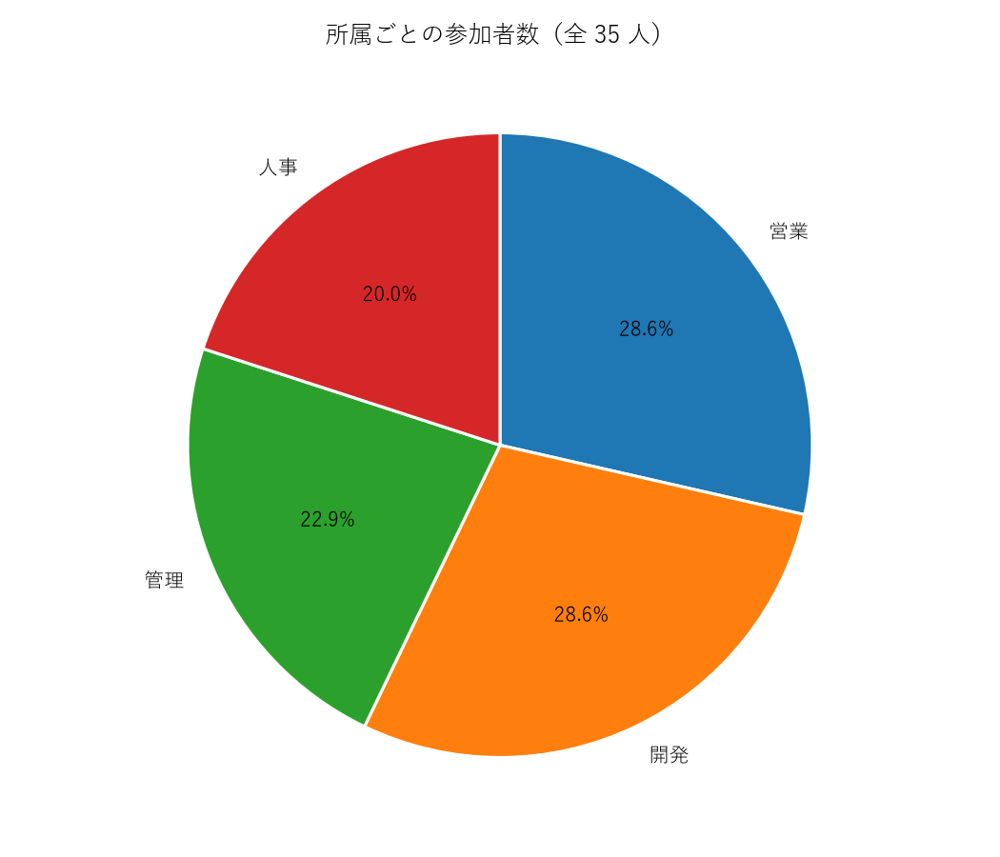
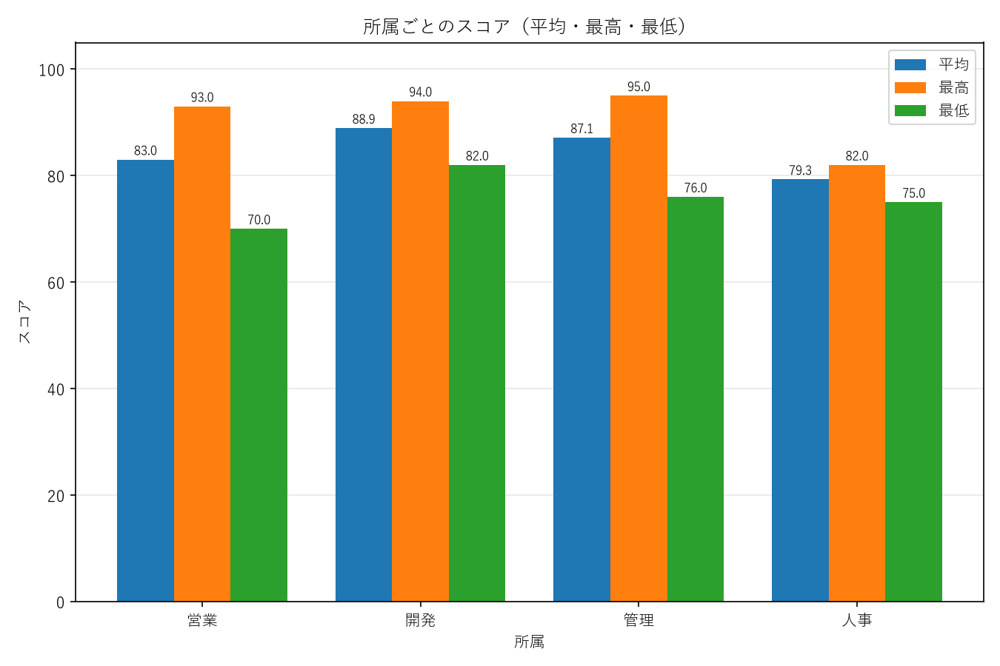
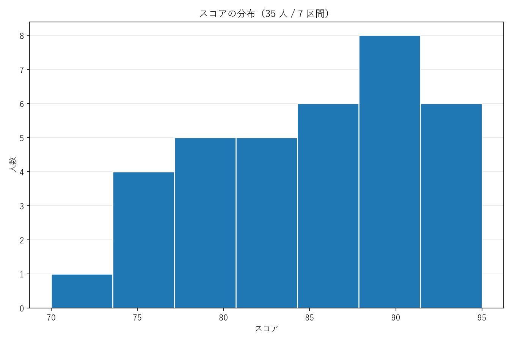

# 4-2-2 課題3: グラフ作成と画像保存

AIエンジニア講座 Section 4-2「Python 実践」の実装課題。

## 課題の要件

CSV ファイルからデータを読み込み、3つのグラフを作成して画像として保存する。

| グラフ | 求められていること |
|---|---|
| 円グラフ | 「所属」ごとの参加者数（または割合）。各セクションにパーセンテージとラベルを付ける |
| 棒グラフ | 参加者または所属ごとの平均スコア（または最高点・最低点）。X 軸に名前または所属、Y 軸にスコア。タイトル・軸ラベル・凡例を付ける |
| ヒストグラム | 全参加者のスコアの分布。適切なビン数を設定する |

配布された CSV は「名前・所属・スコア」の3列で、35 行。所属は営業・開発・管理・人事の4種。

## ファイル

| ファイル | 役割 |
|---|---|
| `score_charts.py` | 課題の成果物。CSV を読んでグラフ3枚を作り、PNG に保存する |
| `data/課題3.csv` | 講座から配布されたデータ（619 バイト・35 行） |
| `charts/01-pie.png` | 出力: 円グラフ |
| `charts/02-bar.png` | 出力: 棒グラフ |
| `charts/03-histogram.png` | 出力: ヒストグラム |
| `tests/test_score_charts.py` | pytest のテスト（50 件） |

## 実行方法

コマンドはすべて**リポジトリのルート**（このファイルの1つ上の階層）で実行する。

課題1・課題2と違い、**matplotlib が要る**。標準ライブラリだけでは描けない。

```powershell
python -m venv .venv
.venv\Scripts\python.exe -m pip install matplotlib pytest
```

```powershell
.venv\Scripts\python.exe task3\score_charts.py
```

`charts/` に3枚の PNG が書き出される。保存先は `--outdir` で変えられる。

```powershell
.venv\Scripts\python.exe task3\score_charts.py task3\data\課題3.csv --outdir task3\charts
```

素の `python` を使うと venv の外の Python を掴み、`No module named matplotlib` になる。
課題2で同じ形の失敗（`No module named pytest`）を踏んでいるので、`.venv\Scripts\python.exe` を明示している。

## 出力

### 円グラフ — 所属ごとの参加者数



営業 10 人・開発 10 人・管理 8 人・人事 7 人。パーセンテージは小数第1位まで出している。

### 棒グラフ — 所属ごとの平均・最高・最低スコア



3系列を並べているのは、**凡例に意味を持たせるため**。1系列だけの棒グラフに凡例を付けても、
色と系列名が1対1で並ぶだけで何も伝わらない。

Y 軸の下限は 0 のままにした。70〜95 に絞れば差は大きく見えるが、棒グラフは棒の長さの比で
読まれるので、途中から描くと差を誇張して伝えることになる。

### ヒストグラム — スコアの分布



度数の合計は 1+4+5+5+6+8+6 = 35 で、全員ぶん入っている。

## 「適切なビン数」をどう決めたか

スタージェスの公式で件数から計算している。

```python
def bin_count(values: Sequence[int]) -> int:
    if not values:
        raise ValueError("ビン数を決められません: 値が1つもありません")
    return math.ceil(math.log2(len(values))) + 1
```

35 件なら `ceil(log2(35)) + 1 = 6 + 1 = 7`。

定数で `7` と書かないのは、課題1で回数制限の上限を範囲から計算したのと同じ理由。
データ件数が変わったときに合わなくなるが、グラフは**それらしい形で描けてしまう**ので気づけない。

| 件数 | ビン数 |
|---|---|
| 10 | 5 |
| 35 | 7 |
| 100 | 8 |

## ハマったところ: 日本語が □ になる

matplotlib の既定フォント `DejaVu Sans` は**日本語のグリフを1文字も持たない**。
そのまま描くと、ラベルがすべて □ の画像ができる。

問題は、**これがエラーにならない**こと。警告が出るだけで、戻り値も例外も正常に見え、
PNG も正しく生成される。画像を開くまで気づけない。

```
Glyph 25152 (\N{CJK UNIFIED IDEOGRAPH-6240}) missing from font(s) DejaVu Sans.
Glyph 21942 (\N{CJK UNIFIED IDEOGRAPH-55B6}) missing from font(s) DejaVu Sans.
```

対策として、実際に入っているフォントを候補から選んで設定している。

```python
JAPANESE_FONT_CANDIDATES = ("Yu Gothic", "Meiryo", "MS Gothic", ...)

def use_japanese_font() -> str:
    installed = {f.name for f in font_manager.fontManager.ttflist}
    for candidate in JAPANESE_FONT_CANDIDATES:
        if candidate in installed:
            ...
            return candidate
    raise RuntimeError("日本語を表示できるフォントが見つかりません。...")
```

フォント名を1つに決め打ちしないのは、そのフォントが無い環境で matplotlib が既定に
黙って戻り、また □ に戻るから。**見つからないなら例外で止める**ことにした。
黙って □ の画像を出すより、動かないほうが安全だと判断した。

## テスト

```powershell
.venv\Scripts\python.exe -m pytest task3\tests -v
```

50 件。画像そのものは目で見るしかないので、検証できるところを3層に分けている。

| 層 | 何を確かめるか |
|---|---|
| 集計値 | 配布 CSV を手計算した値と一致するか |
| 図の中身 | `Axes` を読み、ラベル・パーセンテージ・軸ラベル・凡例が実際に載っているか |
| 保存 | ファイルができ、PNG のシグネチャ（`\x89PNG\r\n\x1a\n`）で始まっているか |

集計の正しさは課題2と同じく、**別のグループ分けで合計を突き合わせて**確かめている。
4つの所属ごとの合計を足した値と、35 行を素直に足した値がどちらも 2,971 になる。
行を1つでも落としていれば一致しない。

## テストが効いているかを、わざと壊して確かめた

**通っているテストの数は、守られている範囲を意味しない。** 課題1・課題2に続いて今回も確かめた。

| 壊した箇所 | 落ちたテスト |
|---|---|
| ビン数の計算を定数 `7` に戻す | 6 件 |
| ヒストグラムのビン数だけ直書き（`bins = 7`） | **最初は 0 件** → 2 件 |
| 日本語フォントを `rcParams` に入れない | **最初は 1 件** → 4 件 |
| BOM 対応を外す（`utf-8-sig` → `utf-8`） | 1 件 |
| 読み飛ばした行を記録せず捨てる | 2 件 |
| 列チェックを外す | 1 件 |

**2か所で穴が見つかった。**

### 穴1: 件数を1つしか試していなかった

ヒストグラムのビン数を `bins = 7` と直書きしても、**48 件すべて通った**。

配布データは 35 件で、`bin_count` の結果もちょうど 7。同じ値なので区別がつかなかった。
件数が 10（→5 ビン）と 100（→8 ビン）のデータを足して、初めて落ちるようになった。

### 穴2: 警告を数えるタイミングが遅かった

日本語フォントの設定を丸ごと外しても、「欠落グリフが無い」テスト3件は**全部素通り**した。
落ちたのは `rcParams` の中身を見ているテスト1件だけ。設定を見ているだけで、
**結果として字が出ているかは確かめられていなかった**。

原因は、警告を集める位置。出来上がった `Figure` を受け取ってから `draw()` していたが、
`build_*` の中の `tight_layout()` が先に文字幅を測っており、警告はその時点で出きっていた。
テストの外で 624 件の警告が出ているのに、テストの中では 0 件に見えていた。

図を**組み立てるところから**警告の記録範囲に入れることで、3件とも落ちるようになった。

課題2では「実装で期待値を測っていた」ことが原因だった。今回は「測る場所が結果より後ろだった」。
どちらも**通っているのに何も守っていないテスト**で、形だけが違う。
